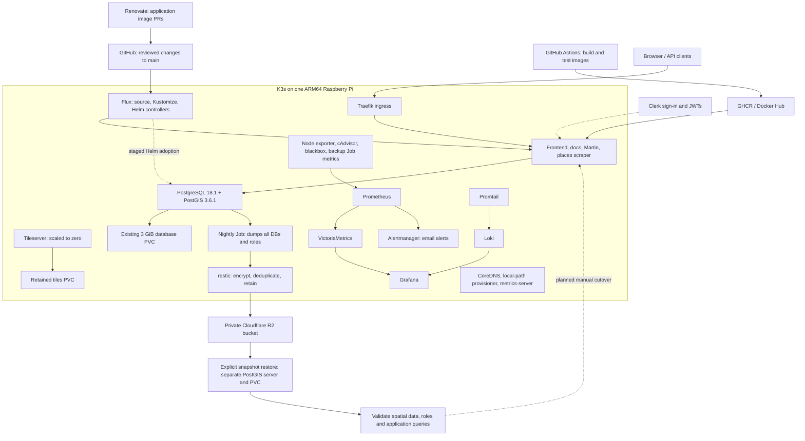

# map-infra

Kubernetes manifests for **lonctus.com** on K3s, reconciled by **Flux CD**.
**Renovate** proposes container image updates through GitHub pull requests.

```text
Build and push an image to Docker Hub / GHCR
  → Renovate scans the registry (every 15 minutes, or image-pushed dispatch)
  → GitHub pull request updates the image tag/digest
  → validation passes and you merge to main
  → Flux fetches main and reconciles the cluster
```

Frontend, docs, and GeoPulse releases publish stable `MAJOR.MINOR.PATCH` image
tags. Renovate updates versioned images and pins their digests; automatic merging
is disabled. Existing `latest` references are retained until a real published
release is adopted with `python3 scripts/adopt-release.py <app> <version>`.
The tile-generator Job is retired; its empty Flux bundle removes existing generator Jobs and Pods while retaining tile storage.
See the semantic-release migration in [DEPLOYMENT.md](DEPLOYMENT.md).

## Infrastructure and recovery



**Status:** database adoption and the nightly CronJob are staged with `suspend: true`.
No backup is running until the [PostgreSQL setup runbook](docs/postgresql.md) is
completed. That guide covers R2 setup, the first backup, restore drills, permanent
PostGIS installation, Helm adoption, and future upgrades. PostgreSQL chart/server
updates require that procedure; Renovate does not automatically change them.

The running pod's PostGIS was installed manually. Before replacing it, build and
test the image in `postgres/`, which includes those libraries permanently.
Logical backups cover all four databases and roles; they do not back up other PVCs,
cluster configuration, or Kubernetes Secrets. Nightly backups allow up to 24 hours
of data loss; this single-node cluster has no database failover or WAL/PITR.

The supplied cluster inventory also contains unmanaged `personal-website`
Deployments in `default` and `lonctus`, plus legacy cross-namespace Services.
These need ownership and dependency checks before adoption or removal. K3s system
resources are managed by K3s; ReplicaSets and Pods are generated by controllers.

## Services

| Service | Namespace | Endpoint |
| --- | --- | --- |
| Frontend | lonctus | lonctus.com |
| Internal docs | lonctus | docs.lonctus.com (Clerk sign-in) |
| Places scraper | lonctus | places-scraper.lonctus.com |
| Martin | lonctus | martin.lonctus.com |
| Tileserver | lonctus | tiles.lonctus.com |
| Monitoring stack | monitoring | Existing Grafana / Loki ingress routes |
| PostgreSQL / PostGIS | database | postgres-postgresql.database.svc.cluster.local:5432 |
| Database backups (staged) | database | Private R2 repository; nightly at 02:15 UTC |

Manifests use Traefik ingress and cert-manager TLS annotations; verify the live
TLS controller and issuer separately. Envoy sidecars validate
Clerk JWTs and apply role rules for protected services. Clerk issuer and JWKS are
under `https://clerk.lonctus.com`; roles are `admin`, `map-viewer`, `data-viewer`,
and `data-editor`. The tileserver Deployment remains intentionally scaled to zero.

## Repository layout

```text
clusters/production/          Flux entrypoint and reconciliation graph
  flux-system/               Generated Flux controllers and Git source
  workloads.yaml             Namespaces, storage, apps, monitoring, database, backups
infrastructure/namespaces/   lonctus, monitoring and database namespaces
infrastructure/database/    Suspended PostgreSQL adoption and backup CronJob
backup/                     Backup/restore container and disposable integration test
postgres/                   Permanent PostgreSQL 18.1 + PostGIS 3.6.1 image
operations/postgres-restore/ Manual recovery environment, excluded from Flux
docs/postgresql.md          R2 setup, backup, restore and database upgrade runbook
apps/                       Application Kustomize bundle
  frontend/, docs/, places-scraper/, martin/, tileserver/
  tileserver/storage/        Retained shared tile PVC
  tileserver/generator/      Empty cleanup bundle; inactive Job reference
  monitoring/               Separate monitoring Kustomize bundle
.github/workflows/           Renovate runner and pull request validation
renovate.json                Image, Flux and tooling update policy
scripts/bootstrap-flux.sh    Bootstrap with an explicit production context
scripts/validate.py          Offline graph, schema and resource validation
kustomization.yaml          Combined workload preview
```

Start with [Fresh Flux installation on Ubuntu](DEPLOYMENT.md#fresh-flux-installation-on-ubuntu).
The guide also covers runtime secrets, GitHub credentials, the image-push trigger,
and optional Argo CD cleanup. Committing configuration alone does
not install Flux or authorize Renovate: complete that setup to activate them.

## Local validation

For an overloaded Raspberry Pi using SD storage, see
[SD-card performance](docs/sd-card-performance.md) for reduced collection settings
and a reversible procedure to pause metrics ingestion.

Install `kubectl`, the Flux CLI version recorded in `gotk-components.yaml`, and
Python 3, then run:

```bash
python3 -m venv /tmp/map-infra-validation-venv
/tmp/map-infra-validation-venv/bin/pip install -r scripts/requirements.txt
/tmp/map-infra-validation-venv/bin/python scripts/validate.py
kubectl kustomize .
```

The root build previews workloads; `clusters/production` is Flux's entrypoint.
GitHub Actions validates both and checks Renovate configuration on every PR.
